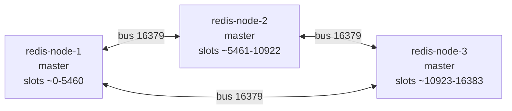
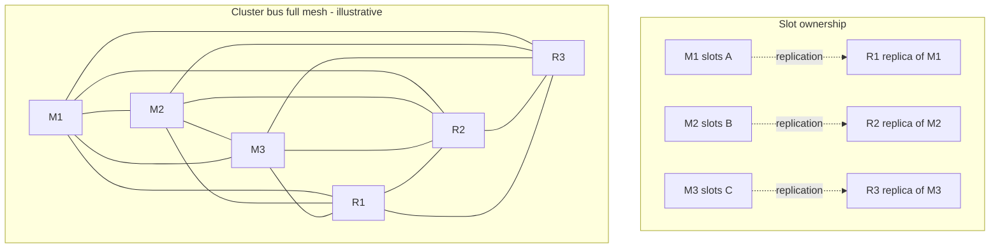
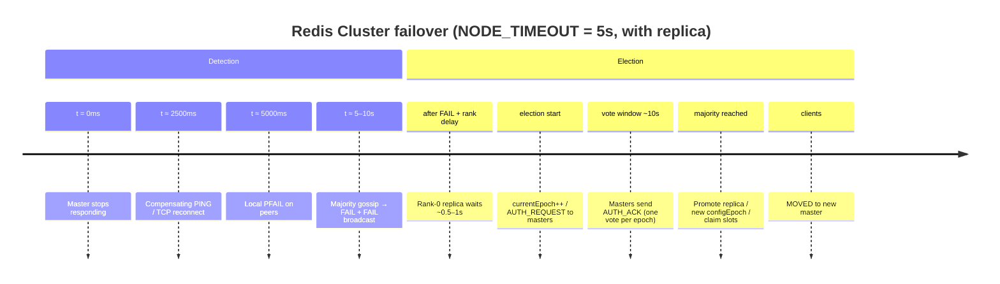

# Redis Cluster — control plane reference

Companion to [Redis.md](./Redis.md). Focus: bus, gossip, failure detection, **failover election timeline**, migration, replica validity, topology diagrams, and **CLI**.

## Ports

| Port | Protocol | Who |
|------|----------|-----|
| `6379` (example) | RESP | Clients + key migration |
| `16379` (client+10000) | Binary cluster bus | Nodes only |

Override bus port with `cluster-port` / `CLUSTER MEET … bus-port`.

## Topology: full-mesh bus links

Redis Cluster is a **full mesh** on the cluster bus: every node keeps a persistent TCP connection to every other node. Client RESP traffic is **not** meshed; only control-plane gossip is.

### Link count

For \(N\) nodes:

| Direction | Count |
|-----------|-------|
| Undirected edges | \(N(N-1)/2\) |
| Directed (out + in per node) | each node: \(N-1\) out, \(N-1\) in |

| Nodes | Undirected bus links |
|-------|----------------------|
| 3 (lab) | **3** |
| 6 (3 masters + 3 replicas) | **15** |
| 10 | **45** |

### QuantumFintek lab (3 masters, no replicas)

```text
                    cluster bus (port 16379)
                 =============================

              redis-node-1 (M)
             /               \
            /  link 1—2        \  link 1—3
           /                     \
  redis-node-2 (M) --------- redis-node-3 (M)
              \    link 2–3    /

  M = master owning ~1/3 of 16384 slots
  Each edge = bidirectional TCP bus link (PING/PONG/MEET/FAIL/UPDATE)
```



### Client plane vs bus plane

```text
  API / redis-py
       |
       | RESP :6379  (slot-routed; MOVED/ASK as needed)
       |
       v
  +----+------+     +----+------+     +----+------+
  | node-1    |     | node-2    |     | node-3    |
  | master    |     | master    |     | master    |
  +-----------+     +-----------+     +-----------+
       ^  \______________|  /______________|  ^
       |         bus mesh :16379 (full)        |
       +---------------------------------------+

  Data plane:  client → one master (per key/slot)
  Control plane: every node ↔ every node
```

### HA topology (3 masters + 3 replicas) — target shape

Not the current lab create flags; shown for when `--cluster-replicas 1` is used.

```text
  Slot ownership (data)          Bus mesh (all 6 nodes fully linked)

  M1 <---repl--- R1              M1 — M2 — M3
  M2 <---repl--- R2               \ | / \ | /
  M3 <---repl--- R3                R1 R2 R3  (each also linked to all others)

  Replication links ≠ bus links
  - repl: master → replica (async data copy)
  - bus:  full mesh among M1,M2,M3,R1,R2,R3 (gossip / votes)
```



### Inspect link health

```bash
docker exec quantum-fintek-redis-1 redis-cli CLUSTER NODES
# link-state column: connected | disconnected

docker exec quantum-fintek-redis-1 redis-cli CLUSTER INFO
# cluster_stats_messages_sent / _received  (bus traffic)
```

If any pair cannot open **16379**, gossip stalls: `disconnected` links, slow or missing FAIL promotion, stuck handshakes.

## Failover election — visual timeline

Times below assume lab **`NODE_TIMEOUT = 5000 ms`** and at least one **valid replica**. With `--cluster-replicas 0`, the timeline **stops after FAIL** (no election).

### ASCII timeline

```text
t (approx)     Detection                         Election (needs replica)
─────────────  ───────────────────────────────   ───────────────────────────────
0              Master M stops responding

~2.5s          Compensating PING / reconnect
               (NODE_TIMEOUT / 2)

~5s            Peers mark M = PFAIL

~5–10s         Gossip builds majority reports
               → M = FAIL + FAIL broadcast
                                                 ┌ rank delay
                                                 │ DELAY = 500ms + rand(0..500)
                                                 │         + RANK×1000ms
                                                 │ rank0 ≈ 0.5–1.0s after FAIL
                                                 └
                                                 currentEpoch++
                                                 FAILOVER_AUTH_REQUEST → masters

                 vote window ≈ max(2s, 2×T) ≈ 10s
                                                 masters → FAILOVER_AUTH_ACK

                                                 majority ACKs?
                                                   YES → promote, new configEpoch,
                                                        claim slots, gossip
                                                   NO  → retry after ~4×T (~20s)

                                                 Clients: MOVED → new master
```

### Mermaid timeline (detection + election)



### Mermaid sequence (election messages)

```mermaid
sequenceDiagram
  autonumber
  participant M as Master M (FAIL)
  participant R0 as Replica rank0
  participant R1 as Replica rank1
  participant A as Master A (voter)
  participant B as Master B (voter)
  participant C as Client

  Note over M: FAIL via gossip majority
  R0->>R0: wait DELAY (rank0 shortest)
  R0->>A: FAILOVER_AUTH_REQUEST (epoch E)
  R0->>B: FAILOVER_AUTH_REQUEST (epoch E)
  A-->>R0: FAILOVER_AUTH_ACK
  B-->>R0: FAILOVER_AUTH_ACK
  R0->>R0: majority → become master, configEpoch=E
  R0-->>C: later commands get MOVED to R0
  Note over R1: longer DELAY; aborts if R0 already won
```

### Timing cheat sheet (T = node-timeout)

| Phase | Formula | Lab T=5s |
|-------|---------|----------|
| Compensating PING | T/2 | ~2.5s |
| PFAIL | ~T | ~5s |
| FAIL | ~T … 2T | ~5–10s |
| Rank delay (rank k) | 500 + rand(0..500) + k×1000 ms | rank0 ~0.5–1s after FAIL |
| Vote wait | max(2s, 2T) | ~10s |
| Retry after failed election | max(4s, 4T) | ~20s |

### Lab note

Current overlay: **`--cluster-replicas 0`** → timeline ends at **FAIL**; no AUTH_REQUEST/promote. Add replicas to exercise the election half.

## CLI command reference

All examples assume Docker lab containers `quantum-fintek-redis-1|2|3`.

### Connection

```bash
docker exec -it quantum-fintek-redis-1 redis-cli              # single node
docker exec -it quantum-fintek-redis-1 redis-cli -c           # follow redirects
docker exec -it quantum-fintek-redis-1 redis-cli -c -h redis-node-2 -p 6379
```

### Cluster state

| Command | Purpose |
|---------|---------|
| `CLUSTER INFO` | `cluster_state`, slots ok/pfail/fail, epochs, bus message stats |
| `CLUSTER NODES` | Node ids, flags (master/slave/fail/pfail), slots, link state |
| `CLUSTER SLOTS` | Slot ranges → master (and replicas) |
| `CLUSTER SHARDS` | Redis 7+ shard view |
| `CLUSTER MYID` | This node’s id |
| `CLUSTER MEET host port [bus-port]` | Join node into cluster |
| `CLUSTER FORGET node-id` | Drop a node from the table |
| `CLUSTER REPLICAS master-id` | List replicas of a master |
| `CLUSTER COUNT-FAILURE-REPORTS node-id` | Active PFAIL reports toward FAIL |
| `CLUSTER KEYSLOT key` | Slot for a key (hash tags honored) |
| `CLUSTER COUNTKEYSINSLOT slot` | Key count in slot |
| `CLUSTER GETKEYSINSLOT slot count` | Sample keys in slot |

```bash
docker exec quantum-fintek-redis-1 redis-cli CLUSTER INFO
docker exec quantum-fintek-redis-1 redis-cli CLUSTER NODES
docker exec quantum-fintek-redis-1 redis-cli CLUSTER COUNT-FAILURE-REPORTS <node-id>
docker exec quantum-fintek-redis-1 redis-cli CLUSTER KEYSLOT 'qf:deny:{abc}'
```

### Config

```bash
CONFIG GET cluster-node-timeout
CONFIG GET cluster-require-full-coverage
CONFIG GET cluster-slave-validity-factor
CONFIG GET cluster-replica-validity-factor
CONFIG SET cluster-node-timeout 5000
```

### redis-cli --cluster helpers

```bash
redis-cli --cluster create h1:6379 h2:6379 h3:6379 --cluster-replicas 0 --cluster-yes
redis-cli --cluster check h1:6379
redis-cli --cluster info h1:6379
redis-cli --cluster reshard h1:6379
redis-cli --cluster rebalance h1:6379
redis-cli --cluster fix h1:6379
```

Via Docker:

```bash
docker exec -it quantum-fintek-redis-1 redis-cli --cluster check redis-node-1:6379
docker exec -it quantum-fintek-redis-1 redis-cli --cluster reshard redis-node-1:6379
```

### Slot migration (manual)

```bash
CLUSTER SETSLOT <slot> IMPORTING <source-id>    # on destination
CLUSTER SETSLOT <slot> MIGRATING <dest-id>      # on source
CLUSTER GETKEYSINSLOT <slot> <count>
MIGRATE <dest-host> <dest-port> "" 0 <ms> KEYS k1 k2 ...
CLUSTER SETSLOT <slot> NODE <dest-id>           # dest, then source
CLUSTER SETSLOT <slot> STABLE                   # clear import/migrate flags
```

### Failover (replica required)

```bash
CLUSTER FAILOVER              # coordinated when possible
CLUSTER FAILOVER FORCE        # primary unreachable; still needs majority
CLUSTER FAILOVER TAKEOVER     # unilateral — use with care
```

### App keys (examples)

```bash
redis-cli -c EXISTS 'qf:deny:{jti}'
redis-cli -c TTL 'qf:deny:{jti}'
redis-cli -c SMEMBERS 'qf:{user-id}:rts'
redis-cli -c GET 'qf:rtidx:{jti}'
```

## Bus packet sketch

```
[RCmb][totlen][ver][port][type][count]
[currentEpoch][configEpoch][offset]
[sender 40][myslots 2048][slaveof][myip][cport][flags][state][mflags]
[ type-specific body ]
```

Common types: PING=0, PONG=1, MEET=2, FAIL=3, PUBLISH=4, FAILOVER_AUTH_*=5/6, UPDATE=7.

## Failure detection

```
no PONG > NODE_TIMEOUT     → PFAIL (local)
gossip + majority masters  → FAIL  (broadcast FAIL msg)
valid replica elected      → new master + MOVED
```

Report TTL ≈ `2 × NODE_TIMEOUT`.  
QuantumFintek lab: `NODE_TIMEOUT=5000` ms.

## Replica validity

```
(node-timeout * cluster-slave-validity-factor) + repl-ping-replica-period
```

- factor **0** = always eligible
- factor **10** = default freshness gate
- No effect with `--cluster-replicas 0`

## Slot migration (classic)

1. `SETSLOT IMPORTING` on dest  
2. `SETSLOT MIGRATING` on source  
3. `GETKEYSINSLOT` + `MIGRATE` until empty  
4. `SETSLOT NODE <dest>` on dest, source, (optional) others  

ASK = one-shot; MOVED = permanent map update.

## Client errors (API)

| Error | Meaning |
|-------|---------|
| ConnectionError / TimeoutError | Node unreachable |
| MovedError | Slot map changed; refresh and retry |
| AskError | One-shot redirect during migration |
| ClusterDownError | Uncovered slots / cluster not ok |

## Related files

- `docker-compose.redis-cluster.yml` — 3-node lab overlay
- `apps/api/app/core/redis.py` — standalone / cluster client
- `apps/api/app/core/config.py` — timeouts and node list
- [Redis.md](./Redis.md) — app keys, timeouts, full CLI quick reference
