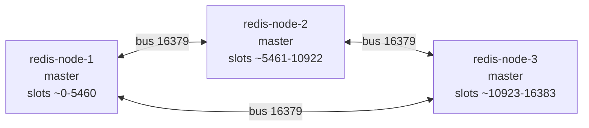
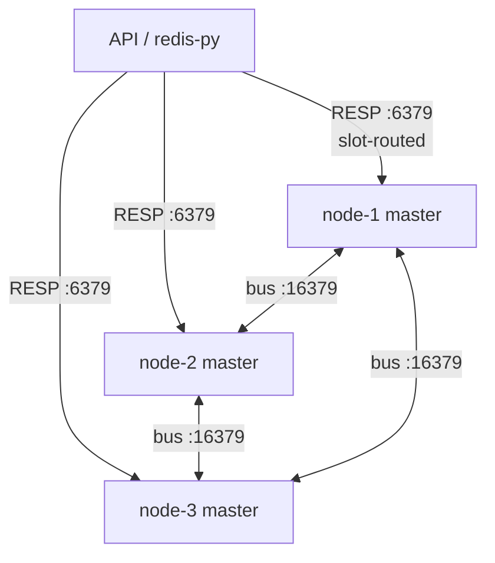

# Redis — sessions & denylist sharding

QuantumFintek uses Redis for:

1. **Access-token denylist** (`logout` / `logout-all`)
2. **Refresh-token store** (rotation + revoke)

## Modes

| Mode | Config |
|------|--------|
| Standalone (default) | `REDIS_MODE=standalone` + `REDIS_URL=redis://localhost:6379/0` |
| Cluster | `REDIS_MODE=cluster` + `REDIS_CLUSTER_NODES=host1:6379,host2:6379,...` |

## Cluster key design (hash tags)

| Key pattern | Slot affinity | Purpose |
|-------------|---------------|---------|
| `qf:deny:{jti}` | by **JTI** | Access denylist entry |
| `qf:{sub}:rt:{jti}` | by **subject** | Refresh session payload |
| `qf:{sub}:rts` | by **subject** | SET of active refresh JTIs |
| `qf:rtidx:{jti}` | by JTI | JTI → subject reverse index |

- Denylist lookups are O(1) and spread across slots by JTI.
- Per-user refresh revoke uses subject-tagged keys in one pipeline (same slot).
- Multi-key ops must share a hash tag `{...}` or Redis returns CROSSSLOT.

## CLI quick reference

Helpers for the Docker lab overlay. Replace node name as needed.

```bash
# Shell aliases (optional)
alias rc1='docker exec -it quantum-fintek-redis-1 redis-cli'
alias rc1c='docker exec -it quantum-fintek-redis-1 redis-cli -c'   # cluster mode
```

### Health & topology

```bash
docker exec quantum-fintek-redis-1 redis-cli PING
docker exec quantum-fintek-redis-1 redis-cli CLUSTER INFO
docker exec quantum-fintek-redis-1 redis-cli CLUSTER NODES
docker exec quantum-fintek-redis-1 redis-cli CLUSTER SLOTS
docker exec quantum-fintek-redis-1 redis-cli CLUSTER SHARDS   # Redis 7+
```

### Config (timeouts / validity)

```bash
docker exec quantum-fintek-redis-1 redis-cli CONFIG GET cluster-node-timeout
docker exec quantum-fintek-redis-1 redis-cli CONFIG GET cluster-require-full-coverage
docker exec quantum-fintek-redis-1 redis-cli CONFIG GET cluster-slave-validity-factor
docker exec quantum-fintek-redis-1 redis-cli CONFIG GET cluster-replica-validity-factor

# Runtime change (may not persist across recreate; prefer compose command args)
docker exec quantum-fintek-redis-1 redis-cli CONFIG SET cluster-node-timeout 5000
```

### Failure reports

```bash
# List nodes; copy a node id from CLUSTER NODES
docker exec quantum-fintek-redis-1 redis-cli CLUSTER NODES
docker exec quantum-fintek-redis-1 redis-cli CLUSTER COUNT-FAILURE-REPORTS <node-id>
```

### Keys & denylist (cluster-aware)

```bash
# -c follows MOVED redirects
docker exec quantum-fintek-redis-1 redis-cli -c EXISTS 'qf:deny:{example-jti}'
docker exec quantum-fintek-redis-1 redis-cli -c TTL 'qf:deny:{example-jti}'
docker exec quantum-fintek-redis-1 redis-cli -c GET 'qf:deny:{example-jti}'

# Which slot a key maps to
docker exec quantum-fintek-redis-1 redis-cli CLUSTER KEYSLOT 'qf:deny:{example-jti}'
docker exec quantum-fintek-redis-1 redis-cli CLUSTER COUNTKEYSINSLOT <slot>
docker exec quantum-fintek-redis-1 redis-cli CLUSTER GETKEYSINSLOT <slot> 10
```

### Cluster create / check (lab)

```bash
docker compose -f docker-compose.yml -f docker-compose.redis-cluster.yml up -d

docker compose -f docker-compose.redis-cluster.yml exec redis-node-1 \
  redis-cli --cluster create \
  redis-node-1:6379 redis-node-2:6379 redis-node-3:6379 \
  --cluster-replicas 0 --cluster-yes

redis-cli --cluster check redis-node-1:6379
# or from host via docker:
docker exec quantum-fintek-redis-1 redis-cli --cluster check redis-node-1:6379
```

### Reshard / rebalance (automation)

```bash
docker exec -it quantum-fintek-redis-1 redis-cli --cluster reshard redis-node-1:6379
docker exec -it quantum-fintek-redis-1 redis-cli --cluster rebalance redis-node-1:6379
docker exec -it quantum-fintek-redis-1 redis-cli --cluster info redis-node-1:6379
```

### Manual slot migration (one slot)

```bash
# IDs from CLUSTER NODES
SRC=<source-node-id>
DST=<dest-node-id>
SLOT=1000

# On destination
docker exec quantum-fintek-redis-2 redis-cli CLUSTER SETSLOT $SLOT IMPORTING $SRC
# On source
docker exec quantum-fintek-redis-1 redis-cli CLUSTER SETSLOT $SLOT MIGRATING $DST

# Move keys in batches (run on source; adjust dest host/port)
while true; do
  KEYS=$(docker exec quantum-fintek-redis-1 redis-cli CLUSTER GETKEYSINSLOT $SLOT 100)
  [ -z "$KEYS" ] && break
  docker exec quantum-fintek-redis-1 redis-cli MIGRATE redis-node-2 6379 "" 0 5000 KEYS $KEYS
done

# Commit ownership (dest then source; optionally all masters)
docker exec quantum-fintek-redis-2 redis-cli CLUSTER SETSLOT $SLOT NODE $DST
docker exec quantum-fintek-redis-1 redis-cli CLUSTER SETSLOT $SLOT NODE $DST

# Abort importing/migrating state on a node
docker exec quantum-fintek-redis-1 redis-cli CLUSTER SETSLOT $SLOT STABLE
```

### Manual failover (requires replicas)

```bash
# On a replica of the target master
docker exec quantum-fintek-redis-X redis-cli CLUSTER FAILOVER
docker exec quantum-fintek-redis-X redis-cli CLUSTER FAILOVER FORCE
docker exec quantum-fintek-redis-X redis-cli CLUSTER FAILOVER TAKEOVER
```

### Meet / forget (membership)

```bash
docker exec quantum-fintek-redis-1 redis-cli CLUSTER MEET redis-node-2 6379
docker exec quantum-fintek-redis-1 redis-cli CLUSTER FORGET <node-id>
docker exec quantum-fintek-redis-1 redis-cli CLUSTER REPLICAS <master-node-id>
```

See also [Redis-Cluster.md](./Redis-Cluster.md) for control-plane detail and more diagrams.

## cluster-node-timeout tuning

Redis default is **15000 ms**. QuantumFintek local cluster overlay uses **5000 ms**.

| Environment | Suggested `REDIS_CLUSTER_NODE_TIMEOUT_MS` | Why |
|-------------|-------------------------------------------|-----|
| Local Docker / same LAN | **5000** | Faster PFAIL→FAIL; RTT is low |
| Single-region production | **10000** | Balance detection vs brief network blips |
| Multi-AZ / higher jitter | **15000** (Redis default) | Avoid false failovers |

### What the timeout controls

- **PFAIL**: peer unreachable longer than `NODE_TIMEOUT`
- **Reconnect attempt**: ~`NODE_TIMEOUT / 2` without PONG
- **FAIL report validity**: ~`NODE_TIMEOUT × 2`
- **Majority loss**: node stops writes after ~`NODE_TIMEOUT` without majority

```
PFAIL  ≈ NODE_TIMEOUT
FAIL   ≈ NODE_TIMEOUT … 2×NODE_TIMEOUT (gossip majority)
```

With **5000 ms**: confirmed FAIL often **~5–10 s**.  
With **15000 ms**: often **~15–30 s**.

### Important: replicas

Lab cluster is created with `--cluster-replicas 0` (masters only).  
Lowering `cluster-node-timeout` **speeds failure detection** but **does not promote a new master**. Uncovered slots stay down until the node returns. For HA, recreate with replicas ≥ 1 per master.

### Client alignment

| Setting | Default | Role |
|---------|---------|------|
| `REDIS_SOCKET_CONNECT_TIMEOUT` | 2.0 s | Fail fast on dead TCP |
| `REDIS_SOCKET_TIMEOUT` | 5.0 s | Matches 5 s node-timeout scale |
| `REDIS_CLUSTER_ERROR_RETRY_ATTEMPTS` | 5 | Retry after MOVED / blips |

Keep **connect timeout < node-timeout**.

```bash
# .env
REDIS_CLUSTER_NODE_TIMEOUT_MS=10000
REDIS_SOCKET_TIMEOUT=8.0
REDIS_CLUSTER_ERROR_RETRY_ATTEMPTS=5
```

```bash
docker compose -f docker-compose.yml -f docker-compose.redis-cluster.yml up -d --force-recreate \
  redis-node-1 redis-node-2 redis-node-3

docker exec quantum-fintek-redis-1 redis-cli CONFIG GET cluster-node-timeout
```

## Failure detection (PFAIL → FAIL)

No central monitor. Every node watches peers on the **cluster bus** via gossip.

| State | Meaning |
|-------|---------|
| **PFAIL** | Local opinion: no PONG within `NODE_TIMEOUT` |
| **FAIL** | Majority of **masters** reported PFAIL/FAIL within ~`2×NODE_TIMEOUT` |

Flow:

1. Missed PONG → **PFAIL** (subjective)
2. Gossip carries PFAIL flags in heartbeat samples
3. Majority master reports → **FAIL** + `FAIL` bus broadcast
4. If the failed node is a master **with a valid replica**, election may promote a new master
5. Clients see `MOVED` / connection errors / `CLUSTERDOWN` during the window

### cluster-slave-validity-factor (replica eligibility)

After FAIL, a replica may refuse to failover if its data looks too old.

```text
max_age ≈ (node-timeout × slave-validity-factor) + repl-ping-replica-period
```

| Value | Behavior |
|-------|----------|
| **0** | Always try failover (max availability; possible stale promote) |
| **10** (default) | Skip failover if disconnected longer than the formula |

Newer Redis names this `cluster-replica-validity-factor` (same meaning).

**Irrelevant until the cluster has replicas.** With `--cluster-replicas 0`, nothing can promote.

## Cluster bus & gossip

| Port | Role |
|------|------|
| Client (e.g. **6379**) | RESP: GET/SET, MIGRATE, app traffic |
| Bus (default **client+10000** → **16379**) | Binary gossip: membership, health, elections |

- Full mesh: every node links to every other on the bus.
- Frames start with signature **`RCmb`** (Redis Cluster message bus).
- Heartbeats: **PING / PONG / MEET**; confirmed failure: **FAIL** packet.
- Header carries sender identity, epochs, and full **16384-bit slot map** (~2 KB).
- Body gossip samples ~`max(3, N/10)` peers (PFAIL biased).

Firewall / Docker: nodes need **both** ports reachable to each other. API clients use **6379 only**.

`clusterCron` (~10 Hz):

- ~1 random PING/s (prefer oldest `pong_received`)
- Compensating PING if silent > `NODE_TIMEOUT/2`
- PFAIL if outstanding ping > `NODE_TIMEOUT`

### Lab mesh (Mermaid)

Three masters, full bus mesh (QuantumFintek overlay):



### Client plane vs bus plane (Mermaid)



More topology diagrams (including 6-node HA mesh): [Redis-Cluster.md](./Redis-Cluster.md).

## Slot migration (classic, Redis 7)

Online reshard without stopping the cluster:

```text
1) Dest:   CLUSTER SETSLOT <slot> IMPORTING <source-id>
2) Source: CLUSTER SETSLOT <slot> MIGRATING <dest-id>
3) Loop:   GETKEYSINSLOT + MIGRATE … KEYS … until empty
4) Both:   CLUSTER SETSLOT <slot> NODE <dest-id>
```

| Redirect | Meaning |
|----------|---------|
| **ASK** | Temporary: one-shot; client sends `ASKING` then command on dest |
| **MOVED** | Permanent: update slot map; slot ownership changed |

Automation: `redis-cli --cluster reshard` / `rebalance`.  
Abort local state: `CLUSTER SETSLOT <slot> STABLE`.

Redis **8.4+** adds server-driven `CLUSTER MIGRATION IMPORT …` (atomic tasks). Lab images are Redis **7** → classic path only.

## Local cluster overlay

```bash
docker compose -f docker-compose.yml -f docker-compose.redis-cluster.yml up -d

docker compose -f docker-compose.redis-cluster.yml exec redis-node-1 \
  redis-cli --cluster create redis-node-1:6379 redis-node-2:6379 redis-node-3:6379 \
  --cluster-replicas 0 --cluster-yes

docker compose -f docker-compose.yml -f docker-compose.redis-cluster.yml up --build api
```

For HA lab tests, use `--cluster-replicas 1` (needs 6 nodes for 3 masters + 3 replicas) and set validity factor explicitly if desired.

## Application behavior

| API | Redis effect |
|-----|----------------|
| `POST /auth/login` | Store refresh under subject tag; index JTI |
| `POST /auth/refresh` | Revoke old JTI; write new |
| `POST /auth/logout` | Denylist access JTI (TTL = remaining exp) |
| `POST /auth/logout-all` | Deny access JTI + all subject refresh keys |
| `validate_access_token` / ForwardAuth | `EXISTS` on denylist key |

## Operational notes

- Prefer non-transactional pipelines under cluster.
- Do not MULTI/EXEC across keys without identical hash tags.
- Logout denylist is best-effort under partition; JWT `exp` remains the hard bound.
- After failover with replicas, denylist keys must have been replicated; async replication can lose a just-written deny until JWT expiry.
